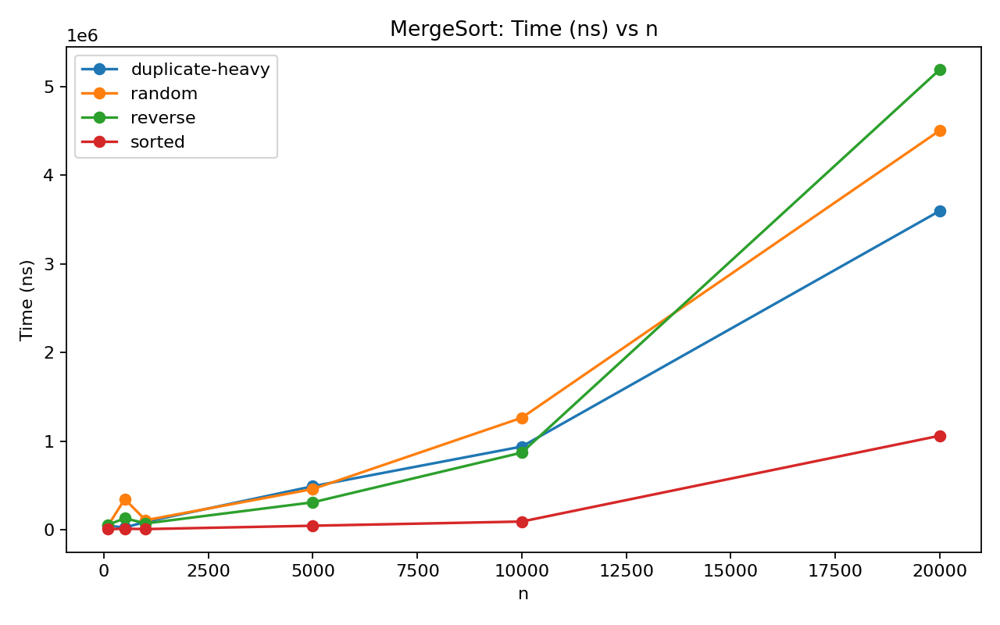
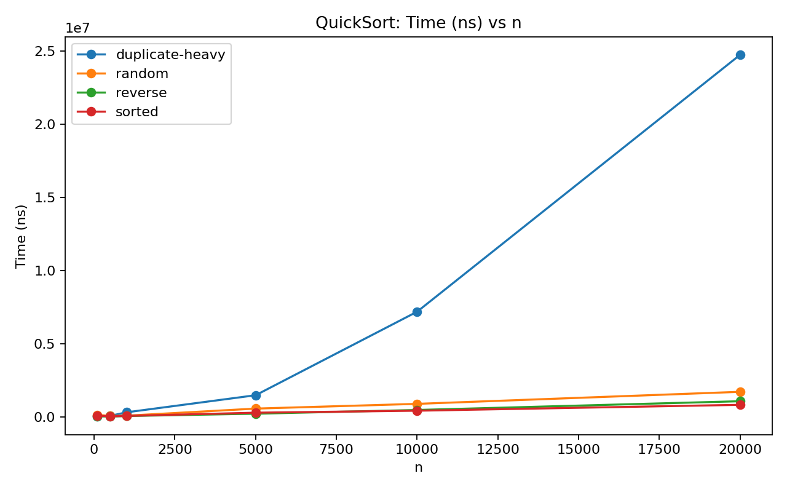
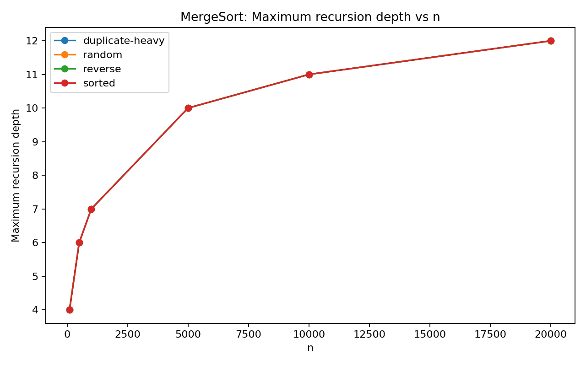
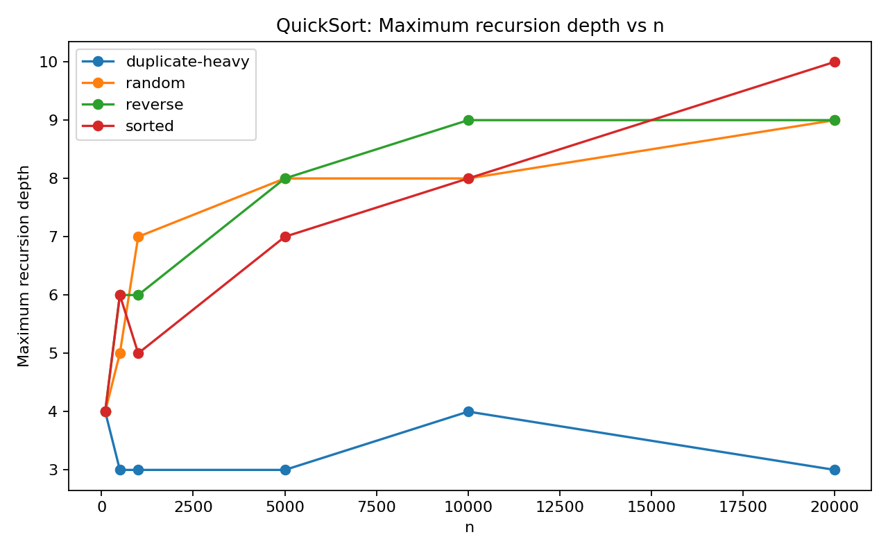

# Assignment 1 — Divide-and-Conquer Algorithm Analysis

## A. Project Overview

This project implements and experimentally evaluates four classic divide-and-conquer algorithms required by the assignment:

1. **MergeSort** — linear merge, reusable auxiliary buffer, and a small-input insertion-sort cutoff.
2. **QuickSort** — randomized pivot, in-place partitioning, and smaller-first recursion.
3. **Deterministic Select (Median-of-Medians)** — groups of five and deterministic pivot selection.
4. **Closest Pair of Points** — recursive divide-and-conquer with a y-ordered strip.

The program records execution time with `System.nanoTime()`, maximum recursion depth, and comparisons. Experimental data is saved in `results/results.csv`.

## Repository Structure

```text
assignment1-divide-and-conquer/
├── src/
│   ├── main/java/
│   │   ├── MergeSorter.java
│   │   ├── QuickSorter.java
│   │   ├── DeterministicSelector.java
│   │   ├── ClosestPairSolver.java
│   │   ├── Point.java
│   │   ├── Metrics.java
│   │   ├── Experiment.java
│   │   └── Main.java
│   └── test/java/
│       └── AlgorithmTest.java
├── docs/
│   ├── screenshots/
│   └── plots/
├── results/
│   └── results.csv
├── scripts/
│   └── plot_results.py
├── README.md
├── pom.xml
└── .gitignore
```

## B. Algorithm Analysis

### 1. MergeSort

MergeSort divides the array into two halves, recursively sorts both halves, and merges them in linear time. The same auxiliary array is reused during the whole sort. For small subarrays, insertion sort is used.

**Recurrence:**

`T(n) = 2T(n/2) + Θ(n)`

By the Master Theorem:

`T(n) = Θ(n log n)`

**Space:** `Θ(n)` for the reusable auxiliary buffer, plus recursion-stack space.

### 2. QuickSort

QuickSort chooses a random pivot, partitions the array in place, and then processes the smaller partition recursively while iterating over the larger partition. This limits the stack depth even when partitions are unbalanced.

For a balanced split:

`T(n) = 2T(n/2) + Θ(n) = Θ(n log n)`

With random pivots, the expected running time is `Θ(n log n)`. The worst case remains `O(n²)`.

The smaller-first recursion strategy guarantees `O(log n)` stack depth because the recursively processed side has at most half of the current problem when the split is considered by size.

### 3. Deterministic Select (Median-of-Medians)

The array is divided into groups of five. Each group's median is found, then the median of those medians is used as the pivot. The algorithm partitions around the pivot and continues only in the partition containing the requested order statistic.

The standard recurrence has the form:

`T(n) ≤ T(n/5) + T(7n/10) + Θ(n)`

The linear work comes from grouping and partitioning. The pivot guarantees that a constant fraction of the elements is discarded, so the recurrence is `Θ(n)`.

**Space:** in-place partitioning uses `O(1)` extra array space; recursion contributes stack space.

### 4. Closest Pair of Points

Points are initially sorted by x-coordinate and y-coordinate. The set is split into left and right halves. Each half is solved recursively. A vertical strip around the dividing line is then checked in y-order.

The recurrence is:

`T(n) = 2T(n/2) + Θ(n)`

Therefore:

`T(n) = Θ(n log n)`

For each point in the strip, only a constant number of following points need to be checked.

## C. Experimental Results

Run:

```bash
mvn test
mvn exec:java -Dexec.args=experiment
python3 scripts/plot_results.py
```

The experiment uses several sizes and input structures:

- random
- sorted
- reverse-sorted
- duplicate-heavy

Measured fields:

- `time_ns` — execution time from `System.nanoTime()`
- `recursion_depth` — maximum observed recursion depth
- `comparisons` — comparison count

The CSV file is:

`results/results.csv`

### Time and recursion plots

After generating the CSV and running the plotting script, the following plots are created:

- `docs/plots/mergesort_time.png`
- `docs/plots/quicksort_time.png`
- `docs/plots/mergesort_depth.png`
- `docs/plots/quicksort_depth.png`









## D. Discussion

### Do the results match theoretical complexity?

The measured results should generally follow the theoretical trends, but exact nanosecond values can vary. MergeSort should show approximately `n log n` growth. QuickSort normally shows similar average behavior, while its measured time can vary because its pivot is randomized.

### How does input structure affect performance?

MergeSort is relatively insensitive to whether the input is random, sorted, reverse-sorted, or duplicate-heavy because its divide-and-merge structure does not depend strongly on the initial ordering.

QuickSort can be affected by input structure, although randomized pivots reduce the connection between the original ordering and bad partitions. Duplicate-heavy data is handled using three-way partitioning in the implementation.

### Why does smaller-first recursion help QuickSort?

Only the smaller partition is processed through a recursive call. The larger partition is handled by the surrounding loop. This prevents a long chain of recursive calls and keeps the stack depth logarithmic.

### Why does Median-of-Medians guarantee O(n)?

The median-of-medians pivot has a guaranteed quality: it removes a fixed fraction of elements from consideration after partitioning. Therefore the recursive subproblem shrinks sufficiently fast, while grouping and partitioning each cost linear time.

### Why is divide-and-conquer Closest Pair faster than O(n²) for large inputs?

Brute force compares every pair, which requires `Θ(n²)` distance checks. Divide-and-conquer solves two half-sized problems and only performs linear additional strip processing, producing `Θ(n log n)` complexity.

### Practical factors

Real execution time is affected by JVM warm-up and JIT compilation, CPU scheduling, cache behavior, memory allocation, garbage collection, operating-system load, and measurement overhead. Therefore a single timing result should not be treated as an exact representation of theoretical complexity.

## E. Reflection

This assignment demonstrates how a theoretical recurrence becomes a working implementation. The most important implementation challenge was maintaining the required algorithmic properties while also collecting metrics such as comparisons and recursion depth. Edge cases and duplicate values also require careful handling.

Another challenge is interpreting experimental results. Theoretical complexity describes how running time grows with input size, while actual Java execution is affected by the JVM, cache, garbage collection, and other system factors. Running tests and experiments helped connect the mathematical analysis with practical program behavior.

## F. Screenshots

Place readable screenshots in `docs/screenshots/` before submission. Recommended screenshots:

1. Program output showing all four algorithms.
2. `mvn test` output showing the correctness tests.
3. `results/results.csv` or its terminal output.
4. The generated plots.

Example filenames:

```text
docs/screenshots/program-output.png
docs/screenshots/test-results.png
docs/screenshots/results-csv.png
docs/screenshots/plots.png
```

## GitHub Workflow

The assignment requires a structured Git history. Use commits that reflect actual development, for example:

```text
init: project structure and tests
feat(mergesort): implement merge sort
feat(quicksort): implement randomized quicksort
feat(select): implement median-of-medians
feat(closest): implement closest pair
feat(metrics): add performance measurements
feat(testing): add correctness tests
docs(report): add analysis and plots
fix: handle edge cases
release: v1.0
```

Do not create a fake history if you did not actually make those changes in separate commits. The commit names above are a suggested workflow.

## Submission

Submit the GitHub repository URL in Moodle:

```text
https://github.com/YOUR_USERNAME/assignment1-divide-and-conquer
```

Before submitting, make sure the repository contains the source code, tests, results, plots, screenshots, README, `pom.xml`, and Git history.
